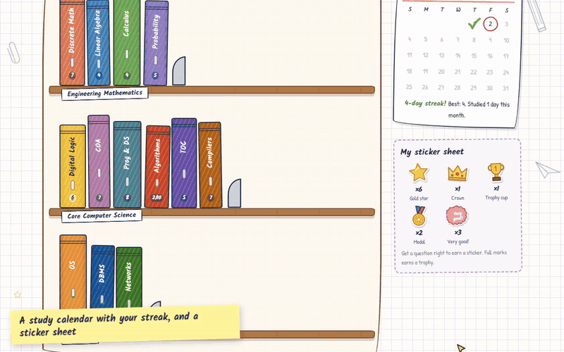
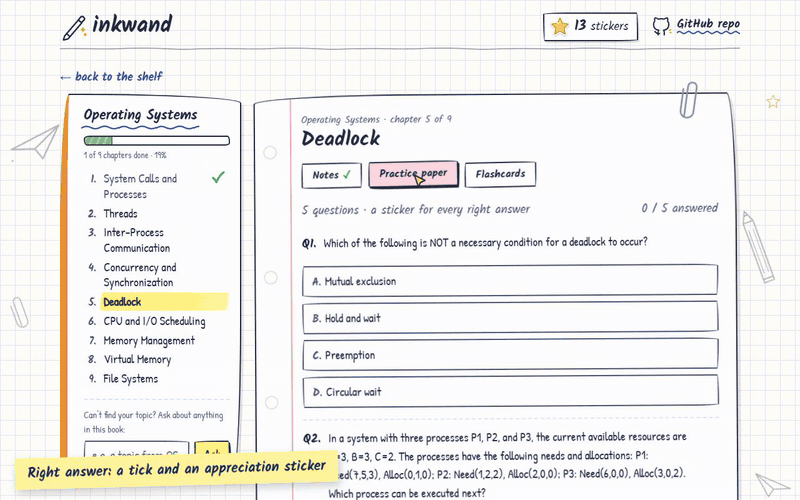
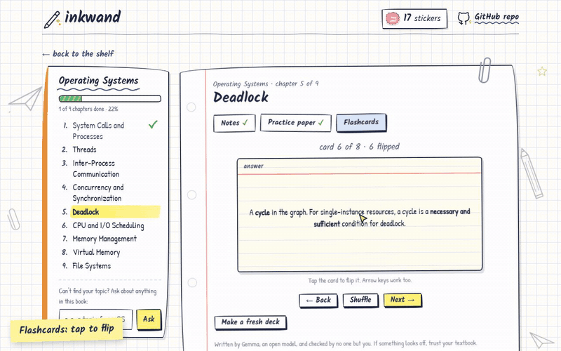
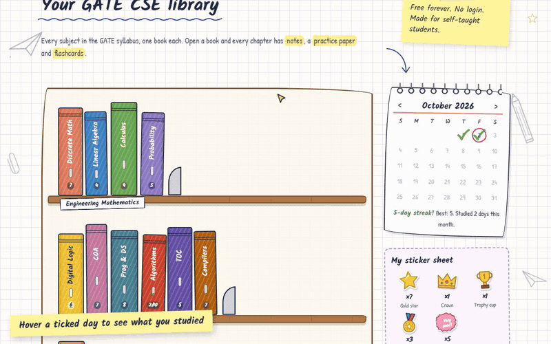
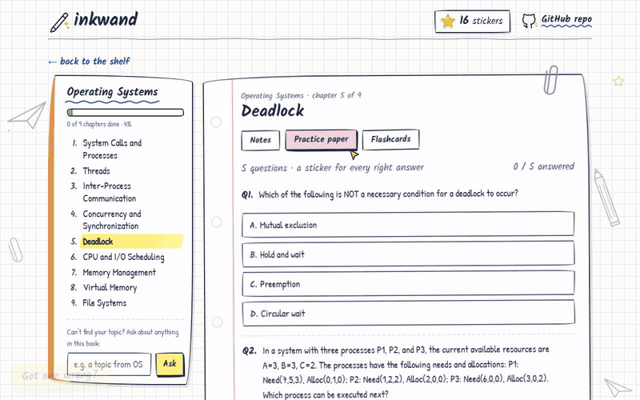
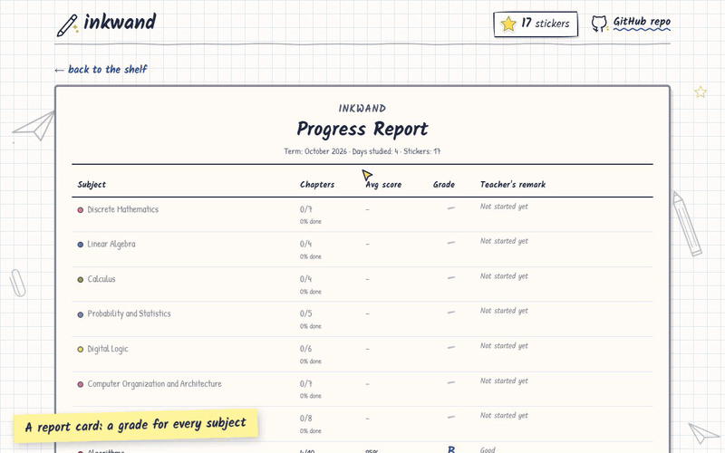
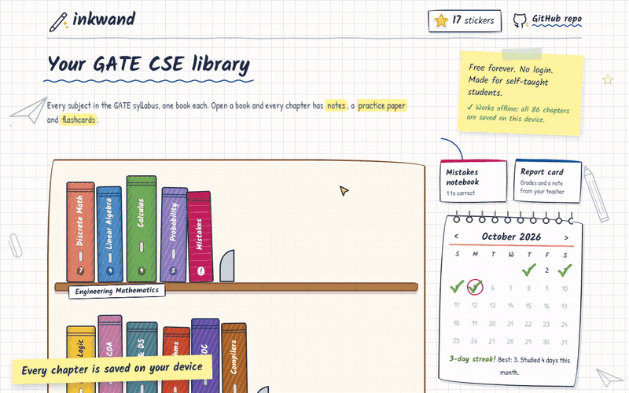

# inkwand

A free study notebook for GATE CSE. Every subject is a book on a shelf, and every chapter comes with notes, a practice paper and a deck of flashcards, all written by Gemma, an open model.

**Try it:** https://inkwand.onrender.com



## What's inside

- **The whole syllabus as a bookshelf.** 13 subjects and 86 chapters, straight from the official GATE 2027 CS syllabus. Click a book and it slides off the shelf and opens.
- **Notes for every chapter**, written like a friendly senior's notes: the idea in simple words, one worked example, the common traps, and one line to remember. Key terms are marked in pink, green and yellow highlighter, and traps get orange.
- **A practice paper for every chapter.** Five exam-style questions. Get one right and a sticker lands on the page (a gold star, a medal, a crown or a "Very good!"). Get one wrong and you get a gentle cross and an explanation. Full marks earns a trophy.
- **Flashcards** you tap to flip, with shuffle.
- **Green ticks.** Read the notes, finish the paper and flip every card, and the chapter gets ticked off. Each book shows how far along you are.
- **A study calendar.** Every day you study gets a tick, there's a streak, and hovering over a day shows what you did that day.
- **Ask about anything.** If a topic is missing, type it into the book's ask box and Gemma writes fresh notes, a paper or flashcards on the spot.
- **A mistakes notebook.** Every question you get wrong is copied into a red notebook on the shelf, like the corrections teachers made us write. Answer it right later and it gets crossed off.
- **A report card.** A grade for every subject, and a note from your "class teacher", written by Gemma from your actual progress, in red pen.
- **Works offline.** The whole library is saved in your browser, so all 86 chapters still open with no internet. Only writing something new needs a connection.
- **No login and no accounts.** Your stickers, ticks and calendar live in your own browser.

## A quick look

**Practice paper with stickers**



**Flashcards, then the chapter gets its green tick**



**The study calendar**



**Get one wrong, correct it later in the mistakes notebook**



**A report card, with remarks from Gemma**



**And it works offline**



## How it works

Everything is written by **Gemma 4**, Google's open-weight model, through the Gemini API.

My first version asked Gemma for notes every time someone opened a page. It worked, but Gemma 4 thinks before it answers, and on the free tier that took anywhere from 45 to 90 seconds per answer. Nobody wants to wait that long for a page of notes. So instead, `scripts/build_library.py` asks Gemma to write the whole library once, all 258 pieces of it, and saves them as JSON files in `data/library/`. The site just serves those files, so chapters open instantly and cost nothing to load.

Gemma is still called live for the "ask about anything" box and the "write me a fresh paper" buttons. Those take about a minute, and the page says so up front.

Every reply from the model gets checked before anyone sees it. Practice papers and flashcards have to come back as proper JSON (four options, one correct answer, an explanation, and so on), validated with Pydantic. If a reply doesn't parse, the server asks once more with a stricter prompt, and if that fails too, you get a friendly message instead of a broken page. And if one Gemma model is having a bad day on the free tier, inkwand quietly asks a second one.

A small service worker (`static/sw.js`) saves the whole library in the browser the first time you visit, which is what makes inkwand work offline.

The front end is plain HTML, CSS and JavaScript with no framework and no build step. Every icon, sticker and drawing is an inline SVG, so there are no image files to download.

### Project layout

```
app/
  main.py          FastAPI app, serves the API and the site
  config.py        site name, links, and the syllabus (books and chapters)
  prompts.py       every prompt sent to the model
  llm.py           a small wrapper around the google-genai SDK
  content.py       writes content and reads or saves the library
  schemas.py       Pydantic models and JSON parsing
  routes/api.py    API routes
static/            index.html, styles.css, app.js, favicon
data/library/      the pre-written chapters, one JSON file each
scripts/
  list_models.py   lists the Gemma models your API key can use
  build_library.py writes the library
tests/             pytest tests, with the model mocked
docs/demo/         the GIFs in this README
render.yaml        Render deploy config
```

## Run it yourself

You'll need Python 3.11 or newer and a free Gemini API key from https://aistudio.google.com/apikey. These steps are for Windows PowerShell, but they translate easily to macOS and Linux.

1. Clone the repo and install everything:

   ```powershell
   git clone https://github.com/pyarchana/inkwand.git
   cd inkwand
   python -m venv .venv
   .\.venv\Scripts\python -m pip install -r requirements.txt
   ```

2. Create your `.env` file and paste your key into it:

   ```powershell
   Copy-Item .env.example .env
   notepad .env
   ```

   Don't worry, `.env` is in `.gitignore`, so your key never gets committed.

3. Check which Gemma models your key can use:

   ```powershell
   .\.venv\Scripts\python scripts\list_models.py
   ```

   Put the one you like in `.env` as `GEMMA_MODEL`. The default, `gemma-4-26b-a4b-it`, is the faster of the two Gemma 4 models.

4. Start the app and open http://localhost:8000

   ```powershell
   .\.venv\Scripts\python -m uvicorn app.main:app --reload --port 8000
   ```

To run the tests:

```powershell
.\.venv\Scripts\python -m pytest -q
```

### Writing or refreshing the library

The written chapters already come with the repo, so you only need this if you want to fill in something missing or rewrite a chapter:

```powershell
.\.venv\Scripts\python scripts\build_library.py
```

It skips anything that's already written, so it's safe to stop it and run it again later. A few handy options:

```powershell
# just one book
.\.venv\Scripts\python scripts\build_library.py --book os
# rewrite a single chapter
.\.venv\Scripts\python scripts\build_library.py --book os --chapter deadlock --force
# go easier on the free tier if you hit rate limits
.\.venv\Scripts\python scripts\build_library.py --workers 2
```

Want to add a subject or a chapter? Edit `BOOKS` in `app/config.py` and run the script again.

## Deploy on Render

The repo includes a `render.yaml`, so Render can set everything up for you.

1. In the Render dashboard, click **New**, then **Blueprint**, and pick this repo. Render reads `render.yaml` and creates a web service called `inkwand`.
2. When it asks for environment variables, fill these in:

   | Variable | Value |
   |---|---|
   | `GEMINI_API_KEY` | your Gemini API key (required, keep it secret) |
   | `GEMMA_MODEL` | already set to `gemma-4-26b-a4b-it` by `render.yaml` |
   | `PYTHON_VERSION` | already set to `3.11.9` by `render.yaml` |
   | `GEMMA_FALLBACK_MODEL` | optional, the model to try if the main one has a server error. Defaults to `gemma-4-31b-it`, set it to `none` to turn it off |

3. Hit deploy. Render starts the app with `uvicorn app.main:app --host 0.0.0.0 --port $PORT` and checks `/api/health` to know it's up.

Since the library lives in the repo, the site works straight away. Only live writing needs the API key.

`render.yaml` uses Render's **Starter** instance, so the site stays awake and opens instantly. If you'd rather run it for free, change `plan: starter` to `plan: free`. Just know that the free plan goes to sleep after about 15 minutes without visitors, and the next visit takes around a minute to wake it up.

## Why an open model

- **It's free.** Gemma costs nothing on the Gemini API free tier, and good study material shouldn't sit behind a paywall.
- **The content is open too.** The whole library is plain JSON in this repo. If you spot a wrong answer, open a pull request and it's fixed for everyone.
- **No lock-in.** The weights are public. If the hosted API ever changes, the same model can run somewhere else, and only `app/llm.py` needs to change.
- **It works offline.** The whole library is saved in your browser, so every chapter opens with no internet. And because Gemma's weights are public, the model itself can run fully offline too, with no API key at all. A college lab could host the whole thing for its students.

## A note on accuracy

Everything here was written by a model. It's usually right, but not always. If something looks off, trust your textbook, and please open an issue so it can be fixed :)

## License

MIT, see [LICENSE](LICENSE). Made with care by Archana.
